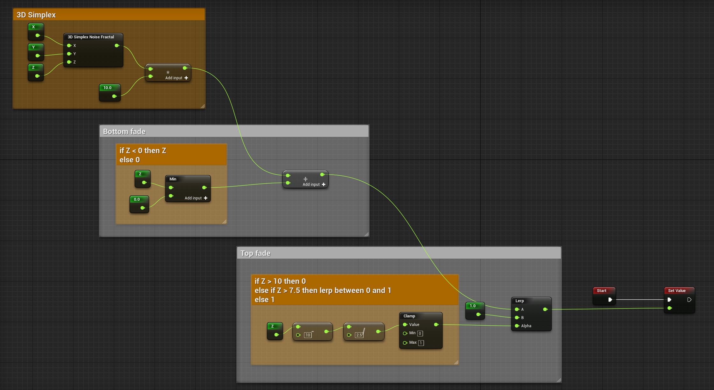

Small ravines
=============

.. image:: img/smallravines.png

Graph
-----

To copy the graph: follow `this link`_, select all and copy to the Voxel Graph editor

.. _this link: ../../_static/smallravines.txt

C++
---

Copy `this file`_ to your project Source directory (make sure to add **Voxel** as a C++ module dependency: :doc:`/installation`)

.. _this file: ../../_static/SmallRavines.h

Bonus: Bigger ravines
---------------------

Make sure to change the scale of the noise in the **Details** panel.

.. image:: img/bigravines_graph.png

.. image:: img/bigravines.png